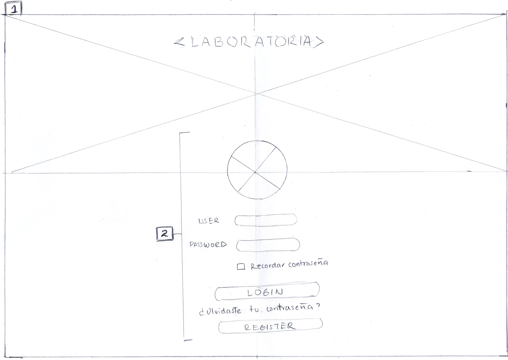
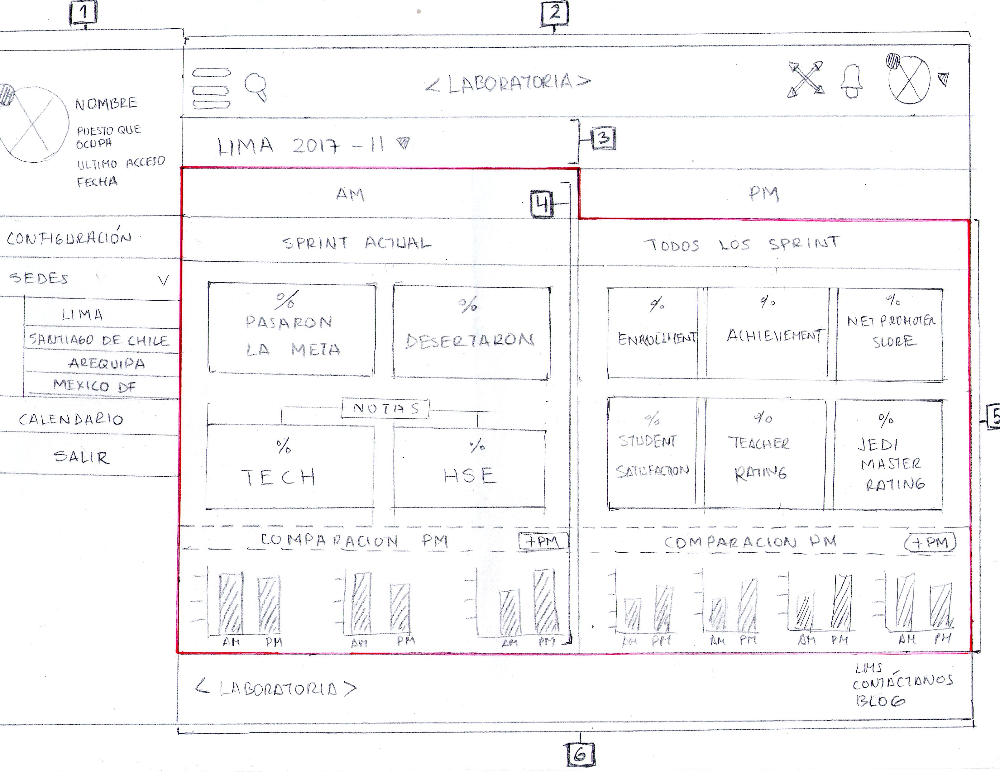

# sketch dashboard

* **Track:** _Common Core_
* **Curso:** _Creando tu primer sitio web interactivo_
* **Unidad 02:** _Intro a User Experience Design_

***

El presente reto pone a prueba nuestros conocimientos básicos sobre UX y UI.

## Objetivo

Crear un sketch para la herramienta del dashboard de Laboratoria, utilizada por profesores, training managers, directores y gerentes de Laboratoria para ver rápidamente qué está pasando en el salón de clases de Laboratoria. En el dashboard, los usuarios mencionados pueden ver rápidamente estadísticas y datos en tiempo real como:

* nº de alumnas inscritas
* nº de alumnas que desertaron
* nº y % de alumnas que pasan el criterio mínimo de evaluación
* Promedio de notas por sprint
* Promedio de notas HSE
* Promedio de notas técnicas

Además, dado que Laboratoria tiene muchas generaciones, regularmente 2 generaciones por año (estas generaciones empezaron en el 2014), y que opera en 4 sedes (Arequipa, Ciudad de México, Lima y Santiago de Chile), es posible que los usuarios quieran ver datos de sedes / generaciones anteriores para poder hacer comparaciones.

### 1. User Log in

1. Pantalla inicial, se mantiene la identidad visual que Laboratoria usa en su página web. Se presenta una imagen que ocupa la mitad de la página, encima lleva el logotipo de Laboratoria.

2. Formulario para introducir usuario y contraseña, en caso de que no esté registrado se presenta un botón para registrarse.

### 2. Dashboard

1. Datos del usuario, con opción a ocultarse y sólo quedarse los iconos para mantener el sentido de ubicación del usuario. Incluye opciones como configuración de usuario, despliegue de todas las sedes, un calendario con fechas marcadas importantes y por último la opción de salir de la cuenta.

2. Navegación global, con las siguientes opciones: icono de búsqueda directa, logo de laboratoria que lleva a la página incial, full screen, notificaciones e imagen de usuario con opciones respecto a su cuenta.

3. Titular de la sede en la que se encuentra el usuario, indicando año y generación.

4. Dentro de la sede, se presentan las opciones AM y PM, en cada una de ellas se presenta la información del sprint actual, las estadísticas corresponden a el número de alumnas que pasaron la meta, aquellas que desertaron, notas divididas en habilidades técnicas y blandas. En la parte inferior se encuentra la comparación con el turno de la tarde, y un botón que dice _"+ pm"_ , que redirige a la pestaña PM.

5. Información de todos los sprints, la estadísticas se dividen en _enrollment_ que indica cuántas alumnas siguen estudiando y aquellas que desertaron, _achievement_, alumnas que alcanzaron el objetivo y las que no, _net promoter score_ promedio de los sprints cursados, _students satisfaction_ el porcentaje de estudiantes satisfechas con la experiencia de Laboratoria, la puntuación promedio de l@s profesores y la puntuación promedio de l@s jedi masters.

6. Footer de laboratoria, que siempre está presenta mientras el usuario está en el dashboard, forma parte de la navegación global.

## Autor

* Gabriela Mamani Flores.
